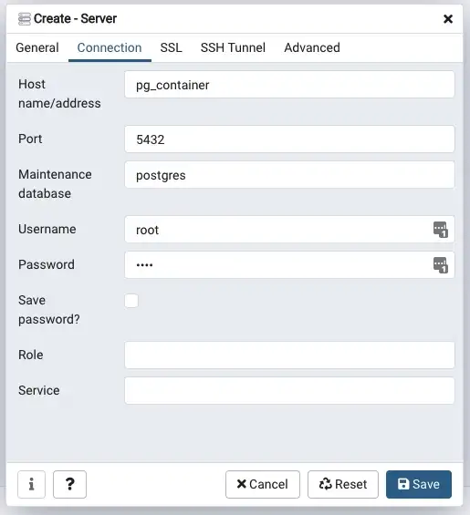

## Запуск postgres

``` bash
docker-compose up
```

## Запуск pgAdmin

<http://localhost:5050/>




Логин, пароль в файле `docker-compose.yml`

## Строка подключения

`@"Host=localhost;Username=root;Password=root;Database=PubDatabase"`

### Добавление пароля пользователю

Если запускать не через docker-compose, то тогда нужно вручную добавить пароль пользователю, 
чтобы использовать в строке подключения

``` bash
docker exec -it pgsql-dev bash
psql -h localhost -U postgres
```
``` sql
ALTER USER postgres PASSWORD 'Pa$$w0rd';
```